# IAM Introduction: Users,Groups,Policies
 **IAM** = Identity and Access Management, is a **Global** service
- Es una cuenta raiz creada por default, esta no debe ser usada o compartida, para ello crearemos los llamados usuarios y grupos.

- **Usuarios** son personas dentro de tu organizacion y pueden ser agrupadas.
- **Grupos** son conjuntos que contienen solo usuarios y no otros grupos.

Un usuario puede no pertenecer a ningun grupo o puede estar en varios grupos a la vez.

Los grupos son creados para darles acceso a los usuarios a ciertas funciones de AWS para ello debemos darles permisos,estas se conocen como politicas **policies**
- Los permisos **Policies** son documentos JSON que pueden ser asignados a usuarios o grupos, estos documentos describen que acciones pueden realizar dentro del entorno de AWS.
- En AWS se debe aplicar el principio de menor privilegio, es decir, no le des a un usuario mas permisos de los que necesita.

    Al momento de entrar a la consola de IAM podemos notar que las regiones estan desactivadas esto se debe a que IAM es un servicio global.
    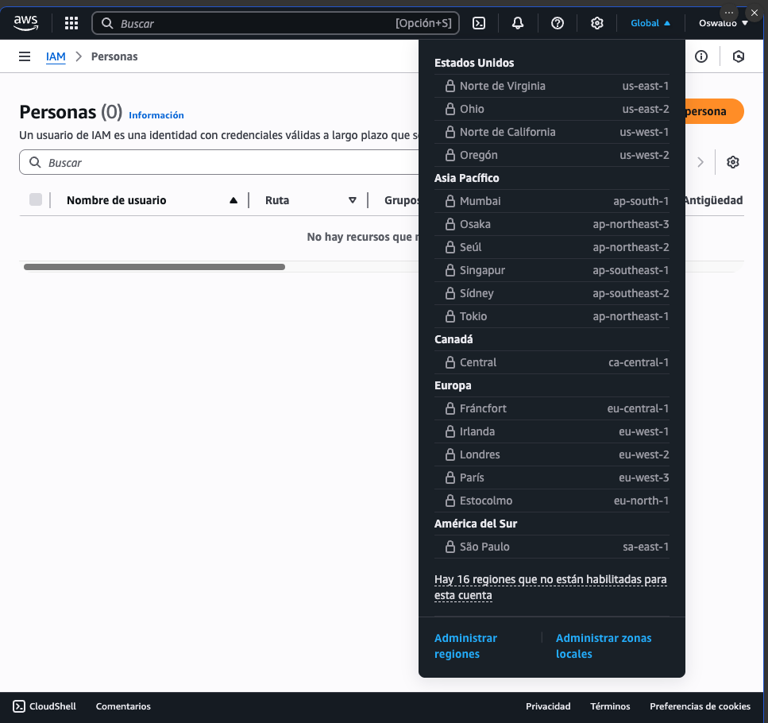

## IAM POLICIES INHERITANCE

Al momento de crear un grupo a las personas pertenecientes a dicho grupo se les otorgan los permisos correspondientes al grupo en el que pertencen a esto se le conoce como herencia de politicas **Policies Inheritance**. Como nota hay que recordar que una persona puede pertenecer a varios grupos por lo cual tendra acceso a los servicios  que su grupo permita.
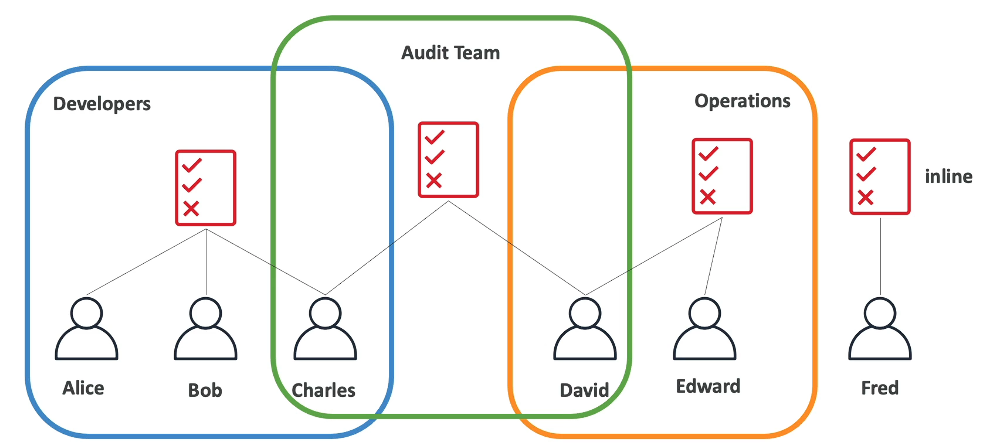

## Estructura de una politica

Las politicas son archivos Json por lo que se ven de esta forma 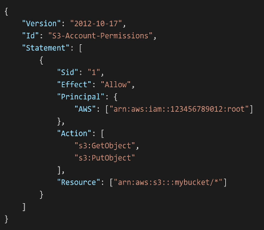
Estos archivos Json estan compuestos por una 
    Version (obligatorio) 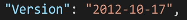
    Id, Un identificador del permiso (opcional)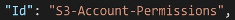
    Statement, una o mas instucciones (obligatorias)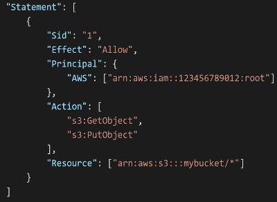

Las Intrucciones se componen de 
    Sid, un identificador de la instruccion (opcional)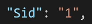
    Effect, nos dice si la instruccion permite o denega el acceso (Allow,Deny)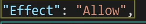
    Principal,la cuenta usuario, rol al cual el permiso es aplicado 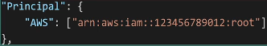
    Action, lista de acciones este permiso permite o denega 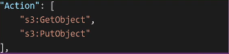
    Resource, Lista de recursos a los que las acciones aplican 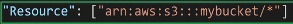
    Conditions, las condiciones que dictan cuando el permiso esta activo (es opcional)

        Nota: Cuando en una politica en el Json aparece * significa que todo esta incluido

## IAM - Password Policy
Como cualquier cuenta, necesita tener una contraseña segura para tu cuenta, entre mas robusta tu contraseña mas segura la cuenta.
En AWS , se puede crear una politica de contraseñas ,entre las cosas que puedes hacer para que tu contraseña sea robusta es    
- Definir un minimo de longitud de la contraseña
- uso de caracteres especificos:
    - Mayusculas 
    - Minusculas
    - numeros
    - Caracteres especiales
- Permitir o denegar que las personas IAM puedan cambiar sus propias contraseñas
- Requerir que los usuarios cambien sus contraselas despues de cierto tiempo (password expiration)
- No permitir repetir contraseñas

Otra manera de aumentar la seguridad de la cuenta es utilizando un MFA **Multi Factor Authenticator**
