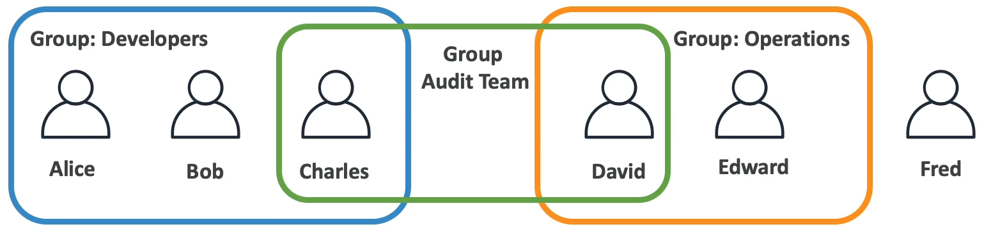
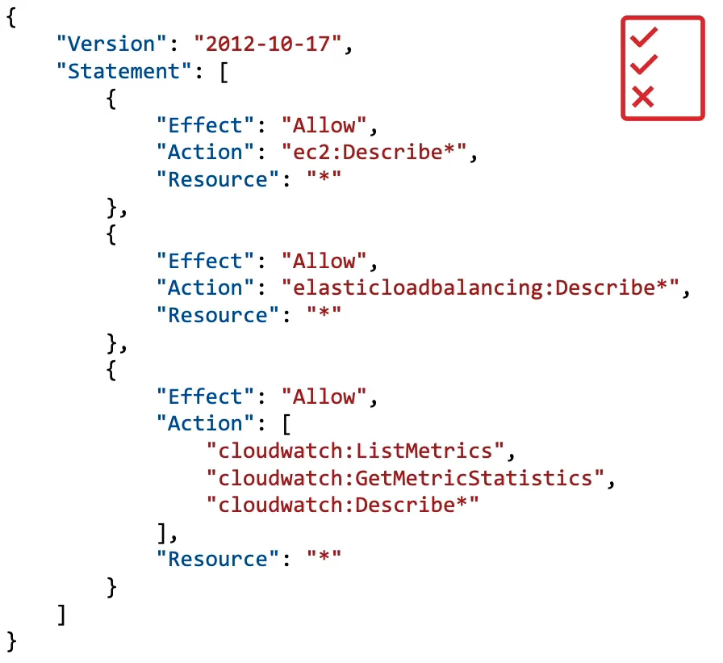

# IAM Introduction: Users,Groups,Policies
 **IAM** = Identity and Access Management, is a **Global** service
- Es una cuenta raiz creada por default, esta no debe ser usada o compartida, para ello crearemos los llamados usuarios y grupos.

- **Usuarios** son personas dentro de tu organizacion y pueden ser agrupadas.
- **Grupos** son conjuntos que contienen solo usuarios y no otros grupos.

Un usuario puede no pertenecer a ningun grupo o puede estar en varios grupos a la vez.

Los grupos son creados para darles acceso a los usuarios a ciertas funciones de AWS para ello debemos darles permisos **policies**
- Los permisos **Policies** son documentos JSON que pueden ser asignados a usuarios o grupos, estos documentos describen que acciones pueden realizar dentro del entorno de AWS.
- En AWS se debe aplicar el principio de menor privilegio, es decir, no le des a un usuario mas permisos de los que necesita.
