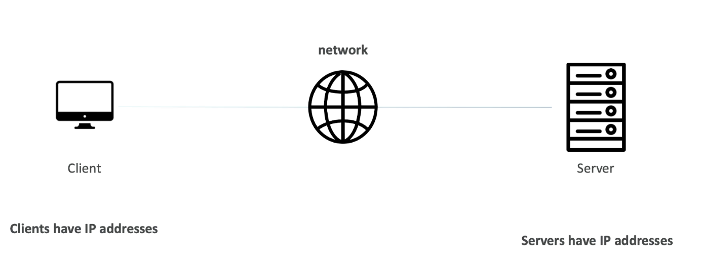
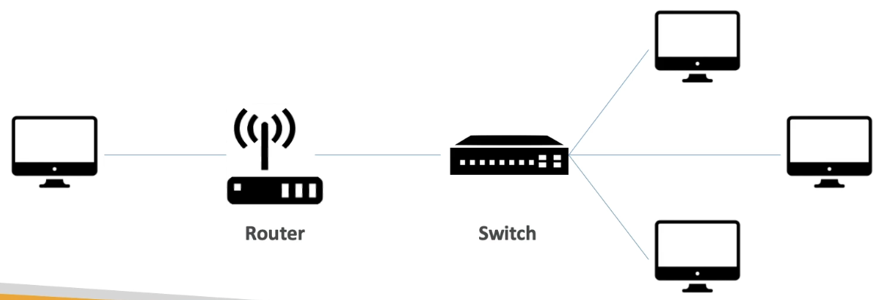
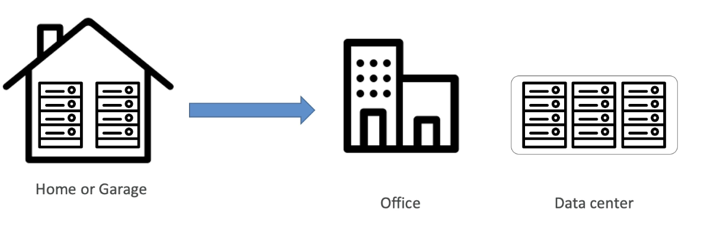

# What is cloud computing?

## Traditional IT Overview

Los sitios web funcionan mediante tres componentes principales: 
- Client (Busca acceder al sitio web)
- Server (Almacena el sitio web)
- Network (Conecta al cliente con el servidor)

Para que el cliente pueda encontrar el servidor y viceversa se necesita algo llamado direccion IP , el cual es un numero unico que identifica a cada dispositivo conectado a internet, es decir , es un numero de identificacion

    ¿como estan compuestos los servidores?

    Estan compuestos por :
    - Compute (Es el CPU y esta encargado de realizar todas las operaciones)
    - Memory (Es la RAM y nos permite almacenar informacion y recuperarla de manera rapida)
    - Storage (Es la informacion que almacenamos pueden ser archivos, los datos no estan estructurados)
    - Database (Es la informacion almacenada de una manera estructurada)
    - Network (Son los cables,routers,switch y servidores conectados)
        - Router (Es un dispositivo que envia paquetes de informacion entre computadoras en una red)
        - Switch (Toman un paquete de informacion y la envian al servidor o al cliente correcto)

### Problemas con el acercamiento tradicional 
- Se necesita pagar por electricidad, refrigeracion, mantenimiento.
- El almacenamiento de los servidores puede ser costoso por rentas.
- Añadir o reemplazar hardware lleva tiempo.
- La escalabilidad es limitada.
- Se necesita tener un equipo 24/7 que monitoree la infraestructura.

Por ello una solucion para este problema es el computo en la nube (Cloud Computing)

## What is cloud computing?

El computo en la nube es el acceso **on-demand** de poder de computo, almacenamieto de bases de datos,aplicaciones y otros recursos de IT.

Una de las caracteristicas de los servicios de computo en la nube es el modelo de pago  **pay-as-you-go**, es decir pagas de acuerdo a los recursos usados.
Además de que puedes ocupar exactamente el tipo y tamaño de los recursos de computo que necesitas.

Otra de las ventajas es que se pueden acceder a tantos recursos como sean necesarios de manera inmediata de forma sencilla.

> En este caso Amazon Web Services son los dueños y quienes mantienen el hardware necesario para estos servicios, mientras que te proveen del servicio y uso de estos recursos mediante una aplicacion web.

