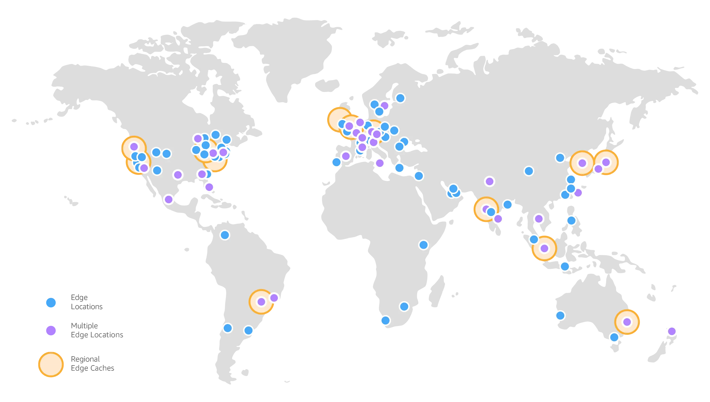

# What is cloud computing?

## Traditional IT Overview

Los sitios web funcionan mediante tres componentes principales: 
- Client (Busca acceder al sitio web)
- Server (Almacena el sitio web)
- Network (Conecta al cliente con el servidor)

Para que el cliente pueda encontrar el servidor y viceversa se necesita algo llamado direccion IP , el cual es un numero unico que identifica a cada dispositivo conectado a internet, es decir , es un numero de identificacion

    ¿como estan compuestos los servidores?

    Estan compuestos por :
    - Compute (Es el CPU y esta encargado de realizar todas las operaciones)
    - Memory (Es la RAM y nos permite almacenar informacion y recuperarla de manera rapida)
    - Storage (Es la informacion que almacenamos pueden ser archivos, los datos no estan estructurados)
    - Database (Es la informacion almacenada de una manera estructurada)
    - Network (Son los cables,routers,switch y servidores conectados)
        - Router (Es un dispositivo que envia paquetes de informacion entre computadoras en una red)
        - Switch (Toman un paquete de informacion y la envian al servidor o al cliente correcto)

### Problemas con el acercamiento tradicional 
- Se necesita pagar por electricidad, refrigeracion, mantenimiento.
- El almacenamiento de los servidores puede ser costoso por rentas.
- Añadir o reemplazar hardware lleva tiempo.
- La escalabilidad es limitada.
- Se necesita tener un equipo 24/7 que monitoree la infraestructura.

Por ello una solucion para este problema es el computo en la nube (Cloud Computing)

## What is cloud computing?

El computo en la nube es el acceso **on-demand** de poder de computo, almacenamieto de bases de datos,aplicaciones y otros recursos de IT.

Una de las caracteristicas de los servicios de computo en la nube es el modelo de pago  **pay-as-you-go**, es decir pagas de acuerdo a los recursos usados.
Además de que puedes ocupar exactamente el tipo y tamaño de los recursos de computo que necesitas.

Otra de las ventajas es que se pueden acceder a tantos recursos como sean necesarios de manera inmediata de forma sencilla.

> En este caso Amazon Web Services son los dueños y quienes mantienen el hardware necesario para estos servicios, mientras que te proveen del servicio y uso de estos recursos mediante una aplicacion web.

### The deployment Models of the Cloud
#### Private Cloud
- Servicios de la
nube usados por una organizacion, no son expuestos al publico.
- Control total por parte del negocio.
- Seguridad para aplicaciones sensibles.
- Soluciona necesidades especificas de negocios.
#### Public Cloud
- Recursos de la nube operadas y manejadas por un proveedor externo accesibles via internet.
- Ventajas de la computacion en la nube 

#### Hybrid Cloud
- Mantiene algunos servidores **on-premise**  y extiende sus capacidades con la ayuda de la nube.
- Control sobre datos sensibles en una infraestructura privada.
- Flexibilidad y eficiencia de costo usando la nube publica.

### The Five Characteristics of Cloud Computing
- **On-demand self service** 
    - Los usuarios tienen a su disposicion recursos y pueden usarlos sin la necesidad de la interaccion humana del proveedor del servicio.
- **Broad network access**
    - Los recursos estan disponibles en la red y se puede acceder a ellos mediante distintas plataformas.
- **Multi-tenancy and resource pooling**
    - Varios usuarios pueden compartir la misma infraestructura y aplicaciones con segurad y privacidad.
    - Multiples usuarios utilizan los mismos recursos fisicos.
- **Rapid elasticity and scalability**
    - Adquisicion/Deposicion automatica y rapida de recursos de acuerdo a las necesidades.
    - Escalabilidad rapida y facil basada en las necesidades.
- **Measured service**
    - El uso es medido, por lo que los usuarios pagan por los recursos usados.

### Six Advantages of Cloud Computing
- **Trade capital expense(CAPEX) for operational expense (OPEX)**

    Con el modelo *Pay On-Demand* no necesitas poseer el hardware necesario lo que reduce el coste total de propiedad (TCO) y el gasto operacional (OPEX)
- **Benefit from massive economies on scale**

    Los precios se reducen ya que AWS es mas eficiente por ser a gran escala.
- **Stop guessing capacity**
    
    Escalabilidad basada en el uso real.
- **Increase speed and agility**
- **Stop spending money running and mantaining data centers**
- **Go global in minutes**
    
    Aprovechando la infraestructura global de AWS.

### Problems solved by the Cloud
- **Flexibility**
    Cambia el tipo de recursos dependiendo las necesidades.
- **Cost-Effectiveness**
    Paga de acuerdo a lo usado.
- **Scalability**
    De acuerdo a las necesidades se puede usar hardware mas potente o añadir nodos adicionales.
- **Elasticity**
    Facilidad para escalar o desescalar de acuerdo a las necesidades.
- **High-availability ad fault-tolerance**
    Esto gracias a multiples centros de datos.
- **Agility**
    Facilidad para desarollar, testear y lanzar aplicaciones.

## Types of Cloud Computing
|Infraestructure as a service **IaaS**|Platform as a Service **PaaS**|Software as a Service **SaaS**|
|---|---|---|
| Provee los bloques necesarios para el computo en la nube|Remueve la necesidad de nuestra organizacion de manejar la infraestructura necesaria.| La totalidad del producto es ejecutada y manejada por el proveedor.|
|Provee la red, computadoras y espacio de almacenamiento | Se centra en el lanzamiento y manejo de nuestras aplicaciones | |
| Posee el mayor nivel de flexibilidad| | |
| Es un analogo del tradicional **on-premises** | | |

## AWS Cloud Overview

### AWS Cloud Use Cases 

AWS te permite construir aplicaciones sofisticadas y escalables para distintos tipos de industrias. Entre los casos de uso estan :
- Almacenamiento y Backup.
- Analisis de datos.
- Hosting de sitios web.
- Aplicaciones para dispositivos moviles.

### AWS Global Infraestructure

La infraestructura de AWS esta compuesta por:
- **Regions** 
    Son ubicaciones fisicas alrededor del mundo donde estan agrupados varios data centers.
    Cada Region de AWS esta compuesta por un minimo de 3 *Availability Zones* (max 6) aislados y fisicamente separados. 
     
- **Availability Zones** 
    Las *Availability Zones (AZ)* son uno o mas centros de datos con alimentacion, redes y conectividad independientes.
    Estan separados entre ellos para mantenerse aislados en caso de desastres.
    Estan interconectados con una red de baja latencia y alto ancho de banda. 
    
- **Data Centers** 
    Son las ubicaciones fisicas que almacenan las computadoras y todo el hardware relacionado. Contienen toda la infraestructura que requieren los sistemas de informacion, como son los servidores, los discos de almacenamento y el equipo de redes.
- **Edge Locations/ Points of Presence** 
    Edge Locations son puntos estrategicamente posicionados de la red de AWS que permiten el envio de contenido con baja latencia, garantizando que la informacion llegue a los usuarios rapidamente. 
    

> ¿Como elegir una region de AWS?
    Para elegir una region de AWS debemos tomar en cuenta lo siguiente:
    - **Compliance** with data governance and legal requirements.
        La informacion nunca debe dejar una region sin permiso explicito.
    - **Proximity** to customers.
        Buscamos que la region este cerca de los clientes para asi poder disminuir la latencia.
    - **Available services** within a Region.
        No todos los servicios y caracteristicas estan disponibles en todas las regiones.
    - **Pricing**.
        Los precios varian de region a region.